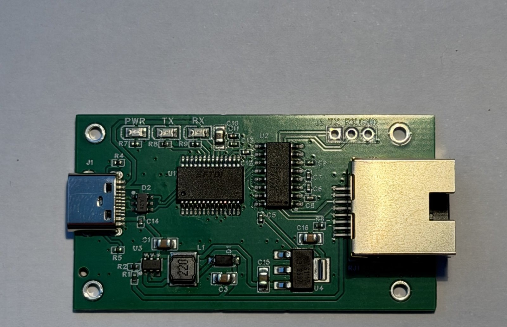
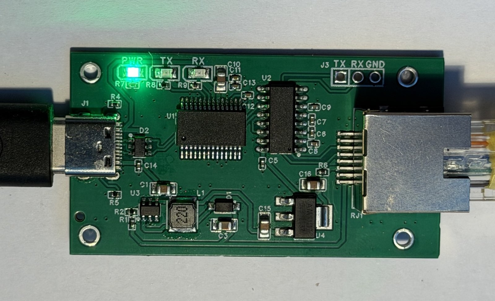
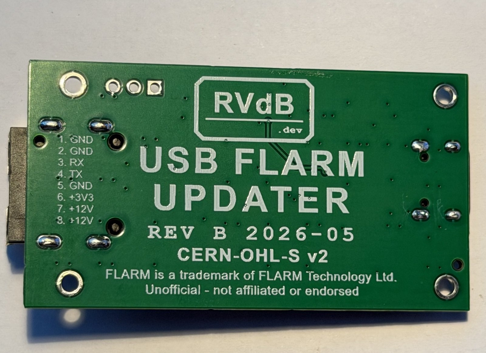

# FLARM USB Updater — REV B

USB-to-RS232 adapter with 12V boost converter for updating FLARM firmware without external power.



Plug into a PC USB port → connect RJ45 cable to FLARM → run firmware update tool. No 12V bench supply required. Also supports FLARM display firmware updates via the same connector.



> **Tip — connection order:** connect the RJ45 to the FLARM *before* plugging the adapter into the PC. If you hot-plug the FLARM while it's already on USB, the COM port may briefly disconnect and reappear — that's harmless inrush (charging the FLARM's input capacitors through the boost momentarily dips the USB 5 V rail and re-enumerates the FT232), not a fault.

> **Status:** REV B fab-ready. Fixes the REV A boost topology bug (12V rail was dead on all REV A boards). See [Archive/REV_A/](Archive/REV_A/) for the REV A schematic, rework guide, and bring-up log.

> **Disclaimer:** This is an unofficial, community-built project. It is **not affiliated with, authorized, sponsored, or endorsed by FLARM Technology Ltd.** "FLARM" and "PowerFLARM" are trademarks of FLARM Technology Ltd.; they are used here only to describe device compatibility. Firmware updates are performed using FLARM's own official update tool — this project supplies power and a serial connection only. Use at your own risk; you are responsible for any device you connect it to.

## Features

- Powered entirely from USB (5V)
- 5V → ~12V boost converter (MT3608) supplies FLARM via RJ45 pins 1 & 2
- FT232RL USB-to-UART bridge — uses Microsoft built-in usbser.sys, no driver install on Win10/11
- MAX3232 RS232 level shifter, powered from the 3.3V rail (±5V signaling, RS232-compliant with all FLARM RS232 ports)
- B5819W Schottky boost freewheel diode — also provides backfeed protection into live 12V aircraft bus
- USB ESD protection (USBLC6-2SC6) on D+/D−
- USB-C connector with proper CC pull-downs
- Power, TX and RX LED indicators
- Dedicated AMS1117-3.3 LDO — 3.3V supply for FLARM accessories (RJ45 pin 3), up to 800mA
- R6 (10Ω) isolates AMS1117 output from FLARM's internal 3.3V on pin 3

## Hardware

Designed in **EasyEDA Pro** for direct JLCPCB SMT assembly ordering.

**PCB REV B:** 53.4 × 30.5 mm (2102 × 1200 mil), 2-layer FR4, 1oz copper. Single-sided top routing with a solid bottom GND plane, 54 stitching vias.

> **Note on C-numbers:** IC and connector C-numbers are confirmed. Passive C-numbers
> (resistors/caps) are from the JLCPCB Basic parts library and should be verified in
> EasyEDA before ordering — search the value + package if a number doesn't match.

### Component List (REV B)

| Ref  | Description                                | JLCPCB # | Class    |
| ---- | ------------------------------------------ | -------- | -------- |
| U1   | FT232RL USB-UART SSOP-28                   | C8690    | Extended |
| U2   | MAX3232CSE+T RS232 transceiver SOIC-16     | C7258    | Extended |
| U3   | MT3608 boost converter SOT-23-6            | C84817   | Extended |
| U4   | AMS1117-3.3 LDO regulator SOT-223          | C6186    | Basic    |
| L1   | 22µH shielded inductor 1A (SMNR4020)       | C135264  | Extended |
| D1   | B5819W SL Schottky 40V/1A SOD-123          | C8598    | Basic    |
| D2   | USBLC6-2SC6 USB ESD clamp SOT-23-6         | C7519    | Extended |
| J1   | USB-C receptacle TYPE-C-31-M-12            | C165948  | Extended |
| RJ1  | RJ45 SMD 8P8C (RJ-064-1)                   | C7205199 | Extended |
| J3   | 1×3 PTH header 2.54mm (unpopulated)        | —        | —        |
| LED1 | Green LED 0805 — power (KT-0805G)          | C2297    | Basic    |
| LED2 | Yellow LED 0805 — TX (KT-0805Y)            | C2296    | Basic    |
| LED3 | Yellow LED 0805 — RX (KT-0805Y)            | C2296    | Basic    |
| R1   | 100kΩ 0402 — MT3608 FB top                 | C25741   | Basic    |
| R2   | 5.1kΩ 0402 — MT3608 FB bottom              | C25905   | Basic    |
| R4   | 5.1kΩ 0402 — USB-C CC1                     | C25905   | Basic    |
| R5   | 5.1kΩ 0402 — USB-C CC2                     | C25905   | Basic    |
| R6   | 10Ω 0402 — RJ45 pin 3 isolation            | C25077   | Basic    |
| R7   | 680Ω 0402 — power LED                      | C25130   | Basic    |
| R8   | 680Ω 0402 — TX LED                         | C25130   | Basic    |
| R9   | 680Ω 0402 — RX LED                         | C25130   | Basic    |
| C1   | 22µF / 25V 0805 — MT3608 Vin               | C45783   | Basic    |
| C3   | 22µF / 25V 0805 — MT3608 Vout              | C45783   | Basic    |
| C5   | 100nF 0402 — MAX3232 VCC bypass (3.3V rail)| C307331  | Basic    |
| C6   | 100nF 0402 — MAX3232 C1+/C1− (charge pump) | C307331  | Basic    |
| C7   | 100nF 0402 — MAX3232 C2+/C2− (charge pump) | C307331  | Basic    |
| C8   | 100nF 0402 — MAX3232 V+ storage            | C307331  | Basic    |
| C9   | 100nF 0402 — MAX3232 V− storage            | C307331  | Basic    |
| C10  | 4.7µF / 25V 0805 — FT232RL VCC bulk        | C1779    | Basic    |
| C11  | 100nF 0402 — FT232RL VCC                   | C307331  | Basic    |
| C12  | 100nF 0402 — FT232RL VCCIO                 | C307331  | Basic    |
| C13  | 100nF 0402 — FT232RL VCC                   | C307331  | Basic    |
| C14  | 100nF 0402 — USBLC6 VCC                    | C307331  | Basic    |
| C15  | 22µF / 25V 0805 — AMS1117 Vin              | C45783   | Basic    |
| C16  | 22µF / 25V 0805 — AMS1117 Vout             | C45783   | Basic    |

**35 components (34 SMT + 1 PTH unpopulated) — 7 Extended parts ($21 JLCPCB setup fees)**

### Net Names

| Net                    | Description                                   | Trace class        |
| ---------------------- | --------------------------------------------- | ------------------ |
| VUSB                   | USB 5V power rail                             | Power (≥20mil)     |
| GND                    | Ground (pour both layers)                     | pour               |
| SW                     | MT3608 switching node (L1 → U3 SW → D1 anode) | default            |
| V12_OUT                | After Schottky D1 (~12.0V) to RJ45 pins 1,2   | Power_12V (≥15mil) |
| V3V3                   | AMS1117-3.3 output                            | default            |
| V3V3_OUT               | After R6 to RJ45 pin 3                        | default            |
| FT_3V3                 | FT232RL 3V3OUT (pin 17, decoupling only)      | default            |
| UART_TX                | FT232RL TXD → MAX3232 T1IN → J3               | default            |
| UART_RX                | MAX3232 R1OUT → FT232RL RXD, also J3          | default            |
| RS232_TX               | MAX3232 T1OUT → RJ45 pin 6                    | default            |
| RS232_RX               | RJ45 pin 5 → MAX3232 R1IN                     | default            |
| UD+, UD−               | USB data, FT232 side (diff pair DP1)          | 6/6 mil            |
| UD_IN+, UD_IN−         | USB data, USB-C side (diff pair DP2)          | 6/6 mil            |
| CC1, CC2               | USB-C configuration channel                   | default            |
| TXLED, RXLED           | FT232RL CBUS0/CBUS1 (active-low) to LEDs      | default            |
| FB                     | MT3608 feedback node                          | default            |
| CP1P, CP1N, CP2P, CP2N | MAX3232 charge pump                           | default            |
| VS_POS, VS_NEG         | MAX3232 V+/V− supply                          | default            |
| LED1_K, LED2_K, LED3_K | LED cathode nodes                             | default            |

### FLARM RJ45 Pinout (8P8C)

| Pin     | Signal    | This device                        |
| ------- | --------- | ---------------------------------- |
| 1, 2    | +12V      | From boost via D1 (~12.0V)         |
| 3       | FLARM 3V3 | From AMS1117-3.3 (U4) via R6 (10Ω) |
| 4, 7, 8 | GND       | PCB GND                            |
| 5       | FLARM TX  | RS232 RX input (MAX3232 R1IN)      |
| 6       | FLARM RX  | RS232 TX output (MAX3232 T1OUT)    |
| 9, 10   | Shield    | PCB GND copper pour                |

The pinout is silkscreened on the back of the board:



> **SMD RJ45 note:** The RJ-064-1 connector uses reversed pad numbering (pad 1 = RJ45 pin 8). The PCB routing compensates for this — the netlist pad references and the RJ45 pin numbers in this table are intentionally different.

**Pin 3 design note:** FLARM outputs 3.3V on pin 3 (up to 200mA per FLARM manual) to power external accessories. The AMS1117-3.3 on this board also outputs 3.3V on pin 3. R6 (10Ω) isolates the two 3.3V sources:

- **FLARM update:** Both regulators output ~3.3V. R6 limits mismatch current to ~10mA max. AMS1117 handles this safely (no protection diode needed with small output caps).
- **Display update:** Display draws power from AMS1117 through R6. At 20mA → 0.2V drop (3.1V), at 50mA → 0.5V drop (2.8V). Most displays work fine at 3.0V+.
- **R6 can be replaced with 0Ω** if display voltage drop is an issue and FLARM backfeed isolation is not needed.

**Display updates — TX/RX crossover cable:** For display firmware updates, TX and RX
are swapped relative to FLARM updates. Use a crossover RJ45 cable (pins 5 and 6 swapped)
labeled "DISPLAY". RS232 is non-damaging if crossed — receivers are high-impedance.

### Breakout Header (unpopulated)

**J3 — TTL UART (1×3, 2.54mm)**

Exposes the TTL-level UART signals between the FT232RL and MAX3232. Not assembled by JLCPCB — solder a pin header when needed.

| Pin | Signal | Description            |
| --- | ------ | ---------------------- |
| 1   | TX     | 3.3V TTL TX from FT232RL |
| 2   | RX     | 3.3V TTL RX to FT232RL   |
| 3   | GND    | Signal reference       |

> **VCCIO note:** The FT232RL VCCIO (pin 4) is tied to 3V3OUT (the FT232RL's internal 3.3V regulator), so J3 outputs **3.3V TTL** and is safe to connect directly to 3.3V MCUs (nRF, RP2040, ESP32, STM32, etc.). FT232RL VCC (pin 20) remains on USB 5V — that powers the USB interface and does not affect the I/O logic level. The MAX3232 is also powered from the 3.3V rail, so the FT232RL↔MAX3232 interface is level-matched on both directions with in-spec margin.

### LED Indicators

| LED  | Colour         | Signal             | Resistor | Current | Behaviour                    |
| ---- | -------------- | ------------------ | -------- | ------- | ---------------------------- |
| LED1 | Green (C2297)  | VUSB → R7 → GND    | 680Ω     | 3.2mA   | Always on when USB connected |
| LED2 | Yellow (C2296) | VUSB → R8 → TXLED# | 680Ω     | 4.3mA   | Flashes during TX            |
| LED3 | Yellow (C2296) | VUSB → R9 → RXLED# | 680Ω     | 4.3mA   | Flashes during RX            |

TXLED# and RXLED# are active-low, default CBUS0/CBUS1 factory config — no EEPROM needed.

## What Else Can It Do?

With the FLARM cable connected, this board provides full RS232 + power — not just firmware updates:

- **IGC flight log download** — open FLARM Tool, download flight logs for OLC/competition submission.
- **FLARM configuration** — change aircraft type, competition ID, NMEA output sentences, baud rate, and other settings via the serial link.
- **Live NMEA diagnostics** — open a serial terminal (PuTTY, Tera Term) at 19200 baud to watch GPS, traffic, and error sentences in real-time.
- **General-purpose RS232 adapter** — make an RJ45 cable with only GND (pins 4/7/8), TX (pin 5), and RX (pin 6) connected. Leave pins 1/2 (12V) and 3 (3.3V) unconnected. The boost converter idles at ~1mA with no load.

## Cable Configurations

| Cable                   | Wiring                  | Use                                                |
| ----------------------- | ----------------------- | -------------------------------------------------- |
| **FLARM** (straight)    | All pins 1:1            | Firmware update, config, IGC download, diagnostics |
| **DISPLAY** (crossover) | Pins 5 ↔ 6 swapped      | Display firmware update                            |
| **RS232 only**          | Pins 4, 5, 6, 7, 8 only | General RS232 (no 12V/3.3V)                        |

## FT232RL EEPROM Customization (optional)

Use FTDI's free **FT_PROG** tool (Windows) to program the FT232RL's internal EEPROM:

- **Device description**: set to "FLARM USB Updater" — shows in Device Manager instead of generic "USB Serial Converter"
- **Serial number**: unique per board — helps identify the right COM port when multiple FTDI devices are connected

One-time USB programming step per board. Not required for basic operation.

## Boost Converter

Standard boost topology (fixed in REV B):

```
VUSB ── L1(22µH) ── SW ── D1 ── V12_OUT ── RJ45 pins 1,2
                    │
                   U3 SW pin
```

Vout = 0.6 × (1 + R1/R2) = 0.6 × (1 + 100k/5.1k) ≈ **12.35V**
After B5819W drop (~0.35V): ≈ **12.0V** at RJ45 — within FLARM 8–36V input range.

| Parameter             | Value                                |
| --------------------- | ------------------------------------ |
| Output voltage        | 12.35V (12.0V after diode)           |
| Duty cycle            | ~60%                                 |
| Inductor ripple       | 113mA peak-to-peak                   |
| Peak inductor current | 304mA (vs 1A L1 rating)              |
| Output ripple         | <1mV estimated                       |
| Output cap            | C3 = 22µF at 25V (2× voltage margin) |

## Power Budget

| Consumer                 | Current (mA) |
| ------------------------ | ------------ |
| FT232RL                  | 15           |
| MAX3232                  | 5            |
| USBLC6                   | 0.5          |
| AMS1117 quiescent        | 5            |
| LED1 (power)             | 3.2          |
| LED2 (TX, avg)           | 2.2          |
| LED3 (RX, avg)           | 2.2          |
| MT3608 boost @ 85mA load | 247          |
| **Total USB draw**       | **~280mA**   |

USB 2.0 limit: 500mA → 56% used. A **regular FLARM runs on any standard USB port** (bench-tested with a Flarm06).

A **PowerFLARM** draws more (~165mA @ 12V → ~510mA on USB) — fine on USB 3.0 / USB-C ports, which supply well above 500mA. On an older 500mA USB 2.0 port that's right at the limit, so if it doesn't power up, use a USB-C charger (1.5A+).

## Cost Estimate (JLCPCB SMT assembly)

| Qty | PCB | SMT | Extended fees | Components | Shipping | Total   | Per board |
| --- | --- | --- | ------------- | ---------- | -------- | ------- | --------- |
| 5   | $2  | $8  | $21           | ~$37.50    | ~$15     | ~$83.50 | ~$16.70   |
| 10  | $4  | $8  | $21           | ~$75       | ~$15     | ~$123   | ~$12.30   |

## Changes from REV A

REV A was ordered, received, and bench-tested. RS232, USB, 3.3V rail, and LEDs all worked. The 12V rail produced 0V on every board due to incorrect boost topology. Rework instructions are preserved in [Archive/REV_A/REV_A_Rework_Guide.md](Archive/REV_A/REV_A_Rework_Guide.md).

**Fixed in REV B:**

1. **Boost topology** — L1 moved from SW↔output to VUSB↔SW. D1 moved from output↔V12_OUT to SW↔V12_OUT. Now a standard boost.
2. **Removed R3** (10kΩ EN pull-up) — EN tied directly to VUSB.
3. **Removed C2** (100nF boost input HF) — not required by MT3608 datasheet.
4. **Removed C4** (4.7µF boost output aux) — not required by MT3608 datasheet.
5. **VBOOST net eliminated** — SW→D1→V12_OUT is one path.
6. **LED2 colour** — corrected from green to yellow (KT-0805Y / C2296) to match physical BOM.
7. **MAX3232 supply** — VCC (U2 pin 16) and its bypass cap C5 moved from VUSB (5V) to the 3.3V rail (AMS1117 V3V3, regulator side of R6). At VCC=3.3V the MAX3232 driver input threshold is 2.0V, which the FT232RL TXD (2.2V min at VCCIO=3.3V) meets in spec; previously the 5V-powered MAX3232 needed 2.4V and was out of spec worst-case. Both ICs now share the 3.3V rail (level-matched). J3 is therefore 3.3V TTL — safe for any 3.3V MCU.

## Design Verification (REV B)

Netlist + BOM review, re-verified 2026-05-15 against the REV B EasyEDA project export (programmatic netlist parse against component datasheets):

- FT232RL: all 28 pins verified (TEST→GND, CTS/DSR/DCD/RI→GND, OSCI/OSCO NC, VCC on VUSB=5V, VCCIO on FT_3V3=3.3V)
- MAX3232: VCC on V3V3 (3.3V rail); C5 VCC bypass; C6/C7 charge pump flying caps; C8/C9 V+/V− storage. Ch1 UART↔RS232. T2IN (pin 10) tied to GND.
- MT3608: VUSB→L1→SW→D1→V12_OUT. Feedback 100k/5.1k → 12.35V. **Boost topology correct (REV A bug fixed).**
- USB-C: CC1/CC2 pulldowns 5.1kΩ, D+/D− through USBLC6, diff-pair rule active (DP1, DP2, 6/6 mil), both orientations
- AMS1117-3.3: V3V3 → R6 (10Ω) → RJ45 pin 3, adequate headroom
- LED circuits: active-low CBUS, correct polarity, 3.2–4.3mA current
- RJ45 pinout: matches FLARM IGC specification (accounting for SMD connector pad reversal)
- GND copper pour on both layers, 54 stitching vias
- Power budget: ~280mA within USB 2.0 500mA limit
- All capacitor voltage ratings: ≥1.8×, all resistor power ratings: <40%

## Bring-up Checklist (before connecting to FLARM)

1. Visual inspection: USB-C orientation, RJ45 jack seating, no tombstoned 0402s
2. USB plug-in: LED1 (green) on. Host enumerates as FTDI serial device.
3. DMM: 5V on VUSB test points, 3.3V on V3V3, **12.0V on V12_OUT (RJ45 pins 1,2)**
4. Loopback test via `flarm_query.py` or `flarm_monitor.py` — TX/RX LEDs flash
5. Connect FLARM on bench supply first (not live 12V aircraft bus) for initial test

## Files

- [EDA/USB_FLARM_UPDATER.eprj](EDA/USB_FLARM_UPDATER.eprj) — EasyEDA Pro project (REV B)
- [EDA/ProPrj_USB_FLARM_UPDATER_2026-05-29.epro](EDA/ProPrj_USB_FLARM_UPDATER_2026-05-29.epro) — REV B as-built source export (the fabbed design)
- [EDA/Gerber_PCB1_2026-05-27.zip](EDA/Gerber_PCB1_2026-05-27.zip) — REV B Gerber for JLCPCB
- [EDA/BOM_Board1_PCB1_2026-05-27.csv](EDA/BOM_Board1_PCB1_2026-05-27.csv) — REV B BOM
- [EDA/PickAndPlace_PCB1_2026-05-27.xlsx](EDA/PickAndPlace_PCB1_2026-05-27.xlsx) — REV B SMT pick-and-place
- [EDA/Netlist_Schematic1_2026-05-27.tel](EDA/Netlist_Schematic1_2026-05-27.tel) — REV B netlist (for parser audit)
- [EDA/silkscreen_back_REV_B.svg](EDA/silkscreen_back_REV_B.svg) — back silkscreen artwork
- [EDA/USB_FLARM_UPDATER_backup/](EDA/USB_FLARM_UPDATER_backup/) — dated project snapshots
- [EDA/3DPCB.step](EDA/3DPCB.step) — board 3D model (STEP) for enclosure / mechanical design
- [Images/](Images/) — board photos used in this README
- [Docs/FLARM_USB_Updater_Design_Document.docx](Docs/FLARM_USB_Updater_Design_Document.docx) — design document (BOM, pinout, power budget, bring-up)
- Component datasheets — see each part's LCSC code (C-number) in the [BOM](EDA/BOM_Board1_PCB1_2026-05-27.csv); enter it at lcsc.com for the datasheet
- [Enclosure/](Enclosure/) — 3D-printable case: `box` + `lid` (STEP/3MF/STL) and `enclosure-assembly.step` (board-in-box fit reference)
- [Archive/REV_A/](Archive/REV_A/) — REV A schematic, PCB, BOM, Gerber, rework guide, bring-up log
- [flarm_query.py](flarm_query.py) — query a connected FLARM (version / device info); [flarm_monitor.py](flarm_monitor.py) — log the serial NMEA stream
- [LICENSE](LICENSE) — CERN-OHL-S v2 licence text

## Support the project

This is fully open hardware — anyone can build the board from the Gerbers in [EDA/](EDA/) and the BOM. If the design or documentation saved you time, or you'd like to back continued development:

- ☕ **[Buy Me a Coffee](https://buymeacoffee.com/rikvdb)** — one-time thanks, any amount
- 🛒 **Pre-built, tested boards** are available for fellow pilots at **~€40, shipping excluded** (cost-share + small margin to fund the next batch). Open a [GitHub issue](../../issues/new) or reach out if interested.

Buying a board doesn't get you anything the open files don't — you're paying for assembly, testing, and the time saved. The repo is the canonical source either way.

## License

Copyright Rik Vanden Boer.

This source describes Open Hardware and is licensed under the **CERN-OHL-S v2** (CERN Open Hardware Licence Version 2 — Strongly Reciprocal). You may redistribute and modify this source and make products using it under the terms of CERN-OHL-S v2 ([LICENSE](LICENSE)).

This source is distributed WITHOUT ANY EXPRESS OR IMPLIED WARRANTY, INCLUDING OF MERCHANTABILITY, SATISFACTORY QUALITY AND FITNESS FOR A PARTICULAR PURPOSE. Please see the licence for the full text.

As a strongly reciprocal licence: if you make and distribute a (modified) board based on this design, you must make the complete source (schematics, PCB, BOM) available under the same licence.

"FLARM" and "PowerFLARM" are trademarks of FLARM Technology Ltd. and are **not** covered by this licence — see the disclaimer at the top of this document.
